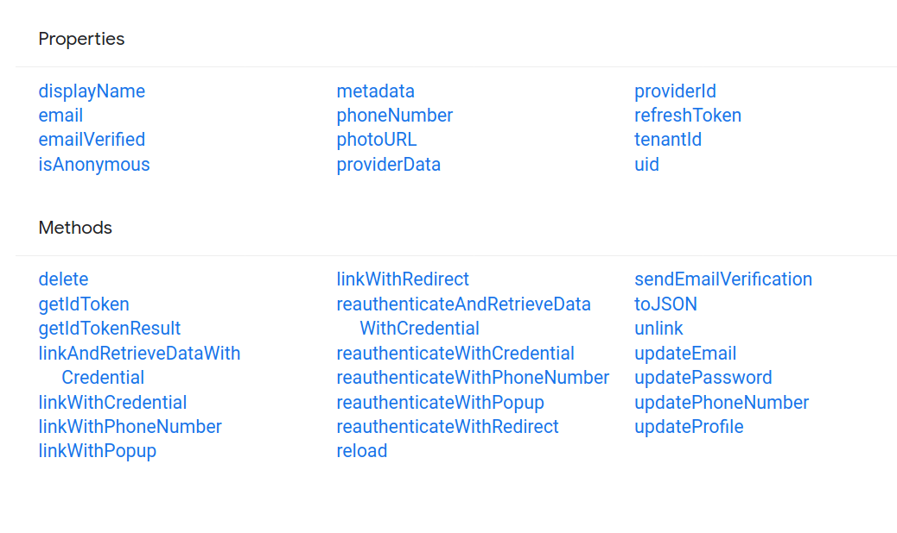

# IMPORTANTE

Si posterior al `npm install` tenes algun error, intenta instalar react-navigation siguiendo las instrucciones de la Documentacion Oficial para la version 4.x

## Firebase Authentication With Email and Passowrd

Primero se inicializa firebase en el entry point de nuestra web app (en nuestro caso App.js) usando el metodo `firebase.initializeApp(firebaseConfig);` donde `firebaseConfig` es un objecto con datos de configuracion que sacamos de la seccion de settings de nuestro proyecto en firebase.

### Uso de la auth() API:

Algunos de los metodos fundamentales son:

**Registrar usuarios nuevos**

Este es el metodo que usamos para registrar usuarios nuevos en la _RegisterScreen.js_.

```javascript
firebase
  .auth()
  .createUserWithEmailAndPassword(email, password)
  .catch(function (error) {
    // Handle Errors here.
    var errorCode = error.code;
    var errorMessage = error.message;
    // ...
  });
```

**Acceso de usuarios existentes**

Este es el metodo que usamos para acceso de usuarios ya registrados en la _LoginScreen.js_

```javascript
firebase
  .auth()
  .signInWithEmailAndPassword(email, password)
  .catch(function (error) {
    // Handle Errors here.
    var errorCode = error.code;
    var errorMessage = error.message;
    // ...
  });
```

**Observador de estado de autenticacion**

Este es el metodo que usamos para decidir a que screen dirigimos al usuario durante la carga de la app en la _LoadingScreen.js_.

```javascript
firebase.auth().onAuthStateChanged(function (user) {
  if (user) {
    // User is signed in.
    var displayName = user.displayName;
    var email = user.email;
    var emailVerified = user.emailVerified;
    var photoURL = user.photoURL;
    var isAnonymous = user.isAnonymous;
    var uid = user.uid;
    var providerData = user.providerData;
    // ...
  } else {
    // User is signed out.
    // ...
  }
});
```

Esto quiere decir, si el usuario se loggeo (`user = true`), entonces crear todas las variables que toman su valor de las propiedades asignadas al objeto `user` cuando se instancia. Sino, `user = false`, significa que el usuario se "desloggeo"

En nuestro caso lo usamos asi en la LoadingScreen.js:

```javascript
componentDidMount() {
    firebase.auth().onAuthStateChanged(user => {
      this.props.navigation.navigate(user ? 'App' : 'Auth');
    });
  }
```

**Obtener el perfil de un usuario**

```javascript
var user = firebase.auth().currentUser;
var name, email, photoUrl, uid, emailVerified;

if (user != null) {
  name = user.displayName;
  email = user.email;
  photoUrl = user.photoURL;
  emailVerified = user.emailVerified;
  uid = user.uid; // The user's ID, unique to the Firebase project. Do NOT use
  // this value to authenticate with your backend server, if
  // you have one. Use User.getToken() instead.
}
```

**Salir de la sesion de un usuario**

```javascript
firebase
  .auth()
  .signOut()
  .then(function () {
    // Sign-out successful.
  })
  .catch(function (error) {
    // An error happened.
  });
```

---

### User properties and methods:

[](https://firebase.google.com/docs/reference/js/firebase.User?authuser=0)

## React Native Vector Icons

### Para proyectos Android

- Option: With Gradle (recommended)

This method has the advantage of fonts being copied from this module at build time so that the fonts and JS are always in sync, making upgrades painless.
1- npm install --save react-native-vector-icons
2- Edit android/app/build.gradle ( NOT android/build.gradle ) and add the following:

apply from: _"../../node_modules/react-native-vector-icons/fonts.gradle"_

To customize the files being copied, add the following instead:
\*project.ext.vectoricons = [
iconFontNames: [ 'MaterialIcons.ttf', 'EvilIcons.ttf' ] // Name of the font files you want to copy
]

apply from: "../../node_modules/react-native-vector-icons/fonts.gradle"\*
3- `react-native link`

Reiniciamos el server, y corremos de nuevo `npm run android`

[Indice de todos los iconos disponibles](https://oblador.github.io/react-native-vector-icons/)

**NOTA IMPORTANTE:** En la instalacion tuvimos un problema con las Fonts de Ionicons. Tuvimos que copiar a manopla el archivo de _node_modules/react-native-vector-icons/Fonts/Ionicons.ttf_ y moverlo a _/android/app/src/main/assets/fonts_

### //TODO:

Agregar documentacion sobre la implementacion de:

- **createStackNavigator**
- **createAppContainer**
- **createSwitchNavigator**

### Tab Navigation

Para crear una bottom tab navigation tenemos que instalar react-navigation-tabs con npm e importarla con `import {createBottomTabNavigator} from 'react-navigation-tabs';`.
Instanciamos un component bottom tab con `createBottomTabNavigator({})`.
Dentro del componente, definimos las screens a las que vamos a poder navegar a partir del mismo, y ademas les agregamos icono y color.
Para esto, en cada objeto screen que agreguemos, modificamos la propiedad `navigationOptions`.

```javascript
import { createBottomTabNavigator } from "react-navigation-tabs";

createBottomTabNavigator(RouteConfigs, TabNavigatorConfig);
```

### [_createBottomTabNavigator()_: lista de parametros de configuracion: ](https://reactnavigation.org/docs/4.x/bottom-tab-navigator#bottomtabnavigatorconfig)

En nuestro caso quedaria asi:

```javascript
const AppTabNavigator = createBottomTabNavigator({
  Home: {
    screen: HomeScreen,
    navigationOptions: {
      tabBarIcon: ({ tintColor }) => (
        <Icon name="ios-home" size={24} color={tintColor} />
      ),
    },
  },
  Message: {
    screen: MessageScreen,
    navigationOptions: {
      tabBarIcon: ({ tintColor }) => (
        <Icon name="ios-chatbubbles" size={24} color={tintColor} />
      ),
    },
  },
  Post: {
    screen: PostScreen,
    navigationOptions: {
      tabBarIcon: ({ tintColor }) => (
        <Icon name="ios-add-circle" size={24} color={tintColor} />
      ),
    },
  },
  Notification: {
    screen: NotificationScreen,
    navigationOptions: {
      tabBarIcon: ({ tintColor }) => (
        <Icon name="ios-notifications" size={24} color={tintColor} />
      ),
    },
  },
  Profile: {
    screen: ProfileScreen,
    navigationOptions: {
      tabBarIcon: ({ tintColor }) => (
        <Icon name="ios-person" size={24} color={tintColor} />
      ),
    },
  },
});
```

Ademas para las `screens` dentro del `navigator` tambien tenemos un parametro de configuracion llamado [`navigationOptions`](https://reactnavigation.org/docs/4.x/bottom-tab-navigator/#navigationoptions-for-screens-inside-of-the-navigator)

Podemos observar que dentro de `navigationOptions` de una screen, tenemos la propiedad `tabBarIcon`, que es una funcion que nos devuelve un react element en base a los parametros que le pasemos. En este caso usamos el elemento Icon que importamos de la libreria Ionicons.

Tambien podemos utilizar la propiedad `tabBarOnPress` que es un callback para manejar press events. El argumento es un objeto conteniendo:

- `navigation`: propiedad navigation para la screen.
- `defaultHandler`: el handler por defecto para manejar el press event.

**tabBarOnPress** es util cuando se requiere una logica en particular antes de generar la transicion a la siguiente pantalla o escena. Cuando definimos tabBarOnPress, tenemos que ademas asignarle el defaultHandler para que sepa que hacer despues de ejecutar la logica.

### [_createStackNavigator()_: lista de parametros de configuracion: ](https://reactnavigation.org/docs/4.x/stack-navigator#stacknavigatorconfig)

Los parametros de configuracion entre `createStackNavigator` y `createBottomTabNavigator` son muy parecidos. Tenemos en ambos `initialRouteName`, `navigationOptions` para el navigator mismo y para cada _route_, y `defaultNavigationOptions` para usar por defecto en todas las _screens_.

**Opciones visuales del stack:**

- `mode` -
  - `card` -Usa las transiciones standard de iOS y Android. El el modo por defecto.
  - `modal`-hace un par de cosas:
    - Setea el `headerMode` a `screen` para el stack.
    - Previene que la ultima screen inactiva sea desacoplada para que siempre este visible por debajo de la screen activa.
    - Hace que las screens hagan un _slide in_ desde abajo, lo que es un patron comun en iOS, y se puedan descartar haciedo un swipe down. El modal no tiene ningun efecto sobre Android.
- `headerMode` -Especifica como se va a renderizar el _header_:
  - `float` -Renderiza un unico _header_ que permanece arriba mientras las screens cambian. Es un patron comun de iOS
  - `screen` -Cada screen tiene su propio header que entra y sale junto con la screen. Patron comun de Android.
  - `none` -Sin header
- `keyboardHandlingEnabled` -Si es `false`, el teclado en pantalla no va a ser automaticamente ocultado cuando se navegue a una nueva pantalla. Default es `true`.

## [Firebase Storage (Firestore)](https://firebase.google.com/docs/firestore?hl=es-419)

## [Expo Permissions](https://docs.expo.io/versions/latest/sdk/permissions/)

```javascript
import Constants from "expo-constants";
import * as Permissions from "expo-permissions";

getPhotoPermission = async () => {
  if (Constants.platform.ios) {
    const { status } = await Permissions.askAsync(Permissions.CAMERA_ROLL);

    if (status != "granted") {
      alert("We need permission to acces your camera roll");
    }
  }
};
```

### [Expo Image Picker](https://docs.expo.io/versions/latest/sdk/imagepicker/)

Provee acceso a la interfaz de usuario del sistema para elegir fotos y videos o tomar una foto con la camara.
`npm install expo-image-picker`

```javascript
import * as ImagePicker from "expo-image-picker";


export default class PostScreen extends React.Component {
  state = {
    image: ""
  };

pickImage = async () => {
    let result = await ImagePicker.launchImageLibraryAsync({
      mediaTypes: ImagePicker.MediaTypeOptions.Images,
      allowsEditing: true,
      aspect: [4, 3]
    });

    if (!result.cancelled) {
      this.setState({ image: result.uri });
    }
  };

```

## Hide Keyboard

Este es un problema con el que me encontre a la hora de usar componentes como `<TextInput>` que tienen un atributo de `autoFocus`. Cuando se montaba el componente de la Screen, automaticamente se activaba el focus sobre el componente TextInput y se abria el teclado y no habia manera de esconder el teclado tappeando en otro lado.
La aparente solucion a este problema es wrappear toda la screen usando **`ScrollView`**.

```javascript
import { ScrollView } from "react-native";
export default class PostScreen extends React.Component {
  render() {
    return <ScrollView>// el resto de codigo.............</ScrollView>;
  }
}
```

## [Firebase BUG](https://github.com/expo/expo/issues/7507)

### Firebase Firestore: Can't find variable: crypto

El problema se "solucionó" instalando base-64 con `npm install base-64` y agregando el siguiente bloque en `App.js`

```javascript
import { decode, encode } from "base-64";
global.crypto = require("@firebase/firestore");
global.crypto.getRandomValues = (byteArray) => {
  for (let i = 0; i < byteArray.length; i++) {
    byteArray[i] = Math.floor(256 * Math.random());
  }
};

if (!global.btoa) {
  global.btoa = encode;
}

if (!global.atob) {
  global.atob = decode;
}
```

## FlatLists

## Layout Animation
